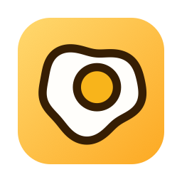

# Yolk



**Your Mac falling asleep shouldn't kill a running agent.**

Long agent loops are mostly waiting — the model thinks, tools run, tests
execute, and nobody touches the keyboard for twenty minutes. macOS sees an idle
machine and goes to sleep, and your run dies partway through. Yolk keeps the
machine awake for exactly as long as you need it, and nothing longer.

It also keeps Slack from quietly marking you away while you sit there watching
the agent work.

Two mechanisms, both running the whole time Yolk is on:

1. **Stays awake** — holds a `PreventUserIdleSystemSleep` power assertion, the
   same one `caffeinate -i` uses. Your loop keeps running.
2. **Stays active** — when system idle time crosses a threshold (default 60s),
   Yolk posts a synthetic mouse-moved event *at the cursor's current position*.
   The cursor never visibly moves, but the system idle timer resets — and that
   timer is exactly what Slack's desktop app reads to decide "away".

If you're actually typing, idle never reaches the threshold and Yolk does
nothing. It only fills the gaps.

<sub>Named for the fried egg — the project started life as "wakey", as in
*wakey wakey, eggs and bakey*. The egg outlived the name.</sub>

## Two ways to run it

**The menu bar app** is the easy one: toggle it on when you kick off a run,
off when you're done. It starts idle, remembers your settings, and can stop
itself after a chosen duration.

**The CLI** is there when you're already in a terminal, or want it scoped to a
script.

Both share one engine, so they behave identically. Running both at once is
harmless — two power assertions, same result.

## Install

### CLI, via Homebrew

```sh
brew install coreyervin/tap/yolk
```

### CLI, from source

```sh
git clone https://github.com/coreyervin/yolk.git
cd yolk
make install          # builds and installs to ~/.local/bin/yolk
```

Override the location with `make install PREFIX=/usr/local`.

### The app

Build it yourself for now:

```sh
make app
open .build/xcode/Build/Products/Release/Yolk.app
```

> **Not yet notarized.** Yolk is signed with a local development certificate,
> so a downloaded build would be blocked by Gatekeeper on any other Mac.
> Building from source is the supported path until a Developer ID signing
> identity is in place. That also means macOS will ask you to grant
> Accessibility permission again after a rebuild on a machine other than the
> one that created the certificate.

Drag `Yolk.app` to `/Applications` if you want **Launch at Login** — macOS only
registers login items reliably from there, and Yolk's settings pane will tell
you so rather than silently failing.

## Using the app

Click the egg in the menu bar:

```
● Yolk is active
Awake 2h 14m · 47 nudges
───────────────────────────
✓ Keep Mac Awake        ⌘K
───────────────────────────
Stop after…
   Never              ✓
   30 minutes
   1 hour
   4 hours
   8 hours
───────────────────────────
Settings…               ⌘,
Quit Yolk               ⌘Q
```

The icon tells you the state at a glance: **filled yolk** when active, **hollow**
when idle, **dimmed** when paused.

Settings covers how often Yolk checks, how long you can be idle before it
steps in, Launch at Login, and your Accessibility permission status.

Changing a setting mid-run applies immediately without resetting the session.
Changing "Stop after" restarts the countdown from now — picking "1 hour" two
hours into a run means one more hour, not instant expiry.

## Using the CLI

```sh
yolk               # run until Ctrl-C
yolk -t 8h         # stop automatically after 8 hours
yolk -v            # log every check and simulated event
```

| Flag | Meaning | Default |
|------|---------|---------|
| `-i, --interval <sec>` | seconds between idle checks (5–120) | 30 |
| `--threshold <sec>` | idle seconds before simulating activity (5–300) | 60 |
| `-t, --timeout <dur>` | auto-exit after `8h`, `90m`, `45s`, `1d`, or seconds | run forever |
| `-v, --verbose` | log every check | off |

`-t` matches `caffeinate -t` semantics. The threshold is capped at 300s so
Slack's ~10-minute away timer can never be reached by accident.

Wrap a long run and have it clean up after itself:

```sh
yolk -t 4h &        # keep the Mac up for the next four hours
```

## Accessibility permission

Posting synthetic input requires **Accessibility** permission. Yolk prompts on
first run; if the prompt doesn't appear, add it manually under **System
Settings → Privacy & Security → Accessibility**.

- Keeping the Mac awake works **without** the permission — only the Slack half
  needs it. Yolk warns you once if its events aren't landing.
- The app and the CLI are separate programs and need separate grants. The CLI's
  grant goes to whatever launched it.
- **tmux users:** macOS attributes the permission to the *responsible process*.
  Inside tmux that's the tmux server, not your terminal — grant it to whatever
  macOS actually prompts for.
- If the app already appears checked but Yolk still says the permission is
  missing, remove it with **–** and add it back. A rebuild changes the app's
  identity, and the old entry no longer matches.

## Walking away

**Lock your screen (Ctrl-Cmd-Q) when you leave.** Yolk pauses simulation while
the screen is locked, so:

- Slack correctly shows you away (it flips on lock regardless),
- your display gets to sleep,
- **your agents keep running** — the power assertion stays held.

That last point is the whole design: locking tells Yolk you walked away, not
that the work should stop.

## Caveats

- While Yolk runs and the screen is unlocked, your display won't sleep and
  auto-lock won't engage — synthetic activity counts as real activity to macOS.
  Locking manually is the walk-away gesture. (This holds as long as your
  display-sleep timeout is longer than `threshold + interval`; Yolk warns at
  startup, and in settings, if it isn't.)
- Yolk pauses when your session is switched out via fast user switching — it
  never posts input into someone else's session.
- Closing the lid still sleeps the Mac, same as `caffeinate -i`.
- If Yolk is killed or crashes, the kernel releases the power assertion
  automatically. Nothing is left stuck.
- Not on the Mac App Store, and won't be: posting synthetic input is
  categorically incompatible with the App Store sandbox.

## Development

```sh
make test            # 129 tests
make cli             # build the CLI
make app             # build Yolk.app with the CLI embedded
make check-version   # MARKETING_VERSION vs YolkKit.version
```

The engine lives in `YolkKit`, behind a `SystemEnvironment` struct of closures
that is the single boundary to the OS — so the whole state machine is tested
against fakes, with no real timers, permissions, or waiting. `YolkAppKit` holds
the app's logic for the same reason: SwiftUI views aren't reachable from
`swift test`, so nothing decidable is allowed to live in them.

The CLI's output is frozen and checked against goldens captured from the
pre-refactor binary. `docs/HANDOFF.md` records what was decided and why.

## Also on the list

- `yolk -- <cmd>`: stay awake only while a wrapped command runs.
- Developer ID signing and notarization, so the app can ship as a download.

## License

MIT — see [LICENSE](LICENSE).
